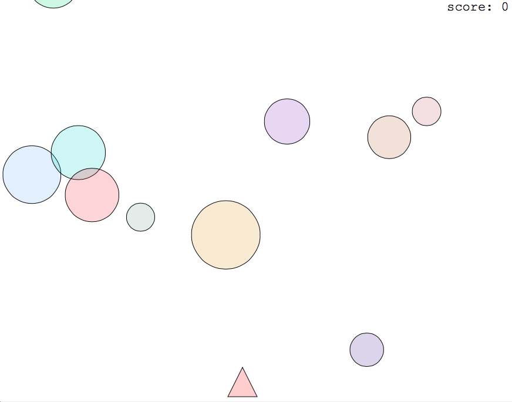
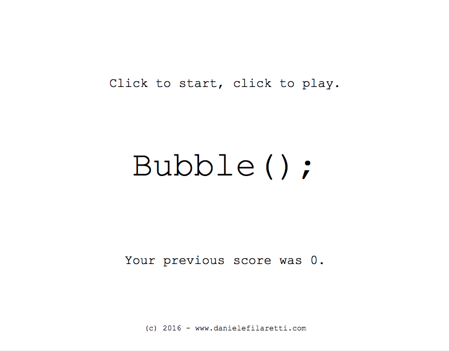

# Bubbles
A minimal shooting game written in JavaScript and [p5.js](http://p5js.org).
Live demo [here](http://dfilaretti.github.io/software/bubbles)

Very useful video lessons for learning JavaScript and p5.js [here](https://www.youtube.com/playlist?list=PLRqwX-V7Uu6Zy51Q-x9tMWIv9cueOFTFA).

